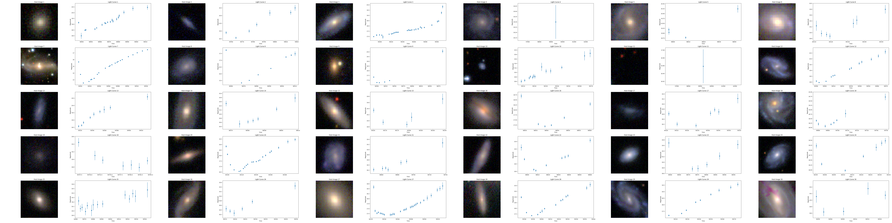

# IAIFI Astro Hackathon: Self-Supervised and Multimodal Learning

Notebooks to be used as a starting point for the IAIFI Astro Hackthon. Centers on using data from the [ZTF Bright Transient Survey](https://www.ztf.caltech.edu/ztf-bts.html) (h/t Alex Gagliano).

- [Notebook 1](./notebooks/01_exploratory_data.ipynb): Data description and exploration
- [Notebook 2](./notebooks/02_ssl_lightcurve_encoder_bts.ipynb): Encoder and self-supervised learning for light curves
- [Notebook 3](./notebooks/03_aligning_representations.ipynb): Aligning image and light curve representations
- [Extra](./notebooks/xx_ssl_lightcurve_encoder): Opening bulk light curves from ZTF
- [Notebook 4](./notebooks/04_clip_finetuning.ipynb): Fine-tuning CLIP and working with text

Notebooks 2 and 3 are independent, so you can skip to notebook 3 if you'd like to looks at aligning multimodal representations directly. Optionally, you can feed in the learned light curve encoder from notebook 2 to notebook 3 to use as a base model, but not needed.

